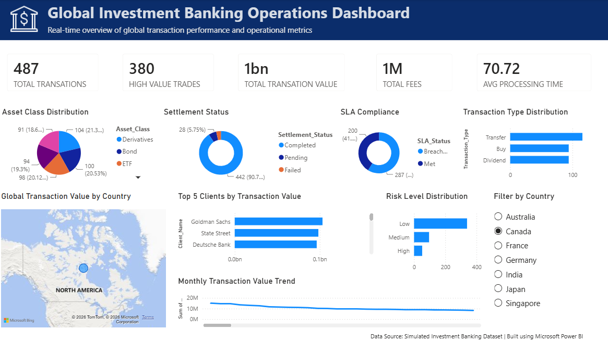

#  Global Investment Banking Operations Dashboard

---

##  Project Overview

This project is an executive-level **Power BI dashboard** designed to monitor and analyze global investment banking operations. It provides a comprehensive view of transaction performance, settlement efficiency, SLA compliance, client activity, transaction types, and operational risk through an interactive dashboard.

The dashboard enables decision-makers to quickly identify trends, monitor KPIs, and make data-driven business decisions.

---

## Key KPIs

-  Total Transactions
-  High-Value Trades
-  Total Transaction Value
-  Total Fees
-  Average Processing Time

---

## Dashboard Features

- Asset Class Distribution
- Settlement Status Analysis
- SLA Compliance Monitoring
- Transaction Type Distribution
- Global Transaction Value by Country (Map)
- Top 5 Clients by Transaction Value
- Risk Level Distribution
- Monthly Transaction Value Trend
- Interactive Country Filter

---

## Tools & Technologies Used

- Microsoft Power BI
- DAX (Data Analysis Expressions)
- Power Query
- Data Modeling
- Interactive Visualizations
- Microsoft Bing Maps

---

## Repository Contents

- `Global Investment Banking Operations Dashboard.pbix` – Power BI dashboard source file
- `dashboard.png` – Dashboard preview image
- `README.md` – Project documentation

---

## Business Insights

- Analyze transaction performance across global markets.
- Monitor settlement success and failure rates.
- Evaluate SLA compliance across operations.
- Identify high-value trading activity.
- Track transaction trends over time.
- Compare client transaction volumes.
- Assess operational risk levels.
- Filter insights by country for regional analysis.

---

## Skills Demonstrated

- Dashboard Design
- Business Intelligence
- Data Visualization
- KPI Development
- DAX
- Power Query
- Data Modeling
- Executive Reporting
- Data Analytics

---

## Future Enhancements

- Drill-through pages for detailed analysis
- Time-based filtering (Month, Quarter, Year)
- Forecasting for transaction trends
- Client performance dashboard
- Real-time data integration
- Row-Level Security (RLS)

---

## Author

**Sriman**

- GitHub: https://github.com/allamsriman
- Aspiring Business Analyst | Power BI Developer | Data Analytics Enthusiast
